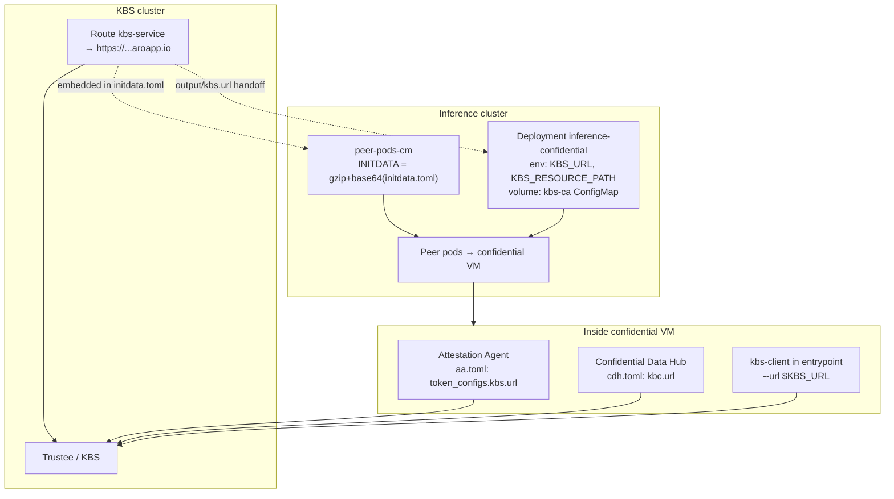
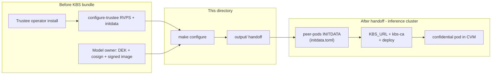

# KBS configuration for TEE remote attestation

This directory contains **KBS-only** steps for a **Trustee cluster** that releases secrets to **remotely attesting** confidential guests (for example AMD SNP peer pods on a **different** inference cluster).

It does **not** deploy workloads or peer pods. It assumes Trustee is already installed and that model artifacts are prepared elsewhere.

## What this configures

| KBS resource | Purpose |
|--------------|---------|
| `confidential-inferencing-signature` | Cosign public key for image pull verification |
| `trustee-image-policy` | Sigstore policy JSON (which images may be pulled) |
| `confidential-inferencing-dek` | Model DEK released only after attestation |
| `trusteeconfig-resource-policy` | Rego: allow `AzSnpVtpm`, deny `sample`-only attesters |

Guest path after configuration: **RCAR attestation** (`POST /kbs/v0/auth`, `POST /kbs/v0/attest`) → attestation token → **GET** `default/confidential-inferencing-dek/dek` (JWE to guest session key).

## Directory layout

```
kbs-tee-attestation/
  inputs/          dek.bin, cosign.pub (from model owner)
  output/          kbs.url, kbs-ca.pem, kbs-resource-path.txt, initdata.toml (generated)
  policy/          Rego + verification-policy template
  scripts/         register DEK, policy, resource rules, export endpoint
  operator.env.example
  Makefile
```

## Prerequisites (before KBS config)

Complete these **on the KBS cluster** (or document who owns each step) **before** `make configure`.

### 1. Trustee operator + base Trustee install

On an ARO (or Kubernetes) cluster with cluster-admin:

1. Install **Trustee operator** and a `TrusteeConfig` (coco-infra `configure-trustee.sh` or equivalent).
2. Confirm pods are ready:

   ```bash
   oc get pods -n trustee-operator-system -l app=kbs
   oc get trusteeconfig trusteeconfig -n trustee-operator-system
   ```

3. **RVPS reference values** and **guest initdata** must match the **pod VM image** your inference cluster will run (`coco-infra/aro/configure-trustee.sh` with `TRUSTEE_ENV=gen`). The operator copies `initdata.toml` into `output/` when you run `make export-endpoint`.

Without matching RVPS/initdata, attestation verifies the wrong measurements and DEK release fails even when policy is correct.

### 2. Remote attestation must be enabled on Trustee / KBS

KBS always uses the **RCAR** protocol for hardware attestation; there is no separate “enable attestation” switch on the HTTP API. For **cross-cluster** guests you need:

| Requirement | Why |
|-------------|-----|
| **`TrusteeConfig.spec.attestationTokenVerificationSpec`** | KBS validates attestation result tokens before the resource plugin releases secrets. `make ensure-remote-attestation` patches this if missing (`tlsSecretName: trustee-token-cert`). |
| **`[attestation_service]` in KBS config** | Trustee operator **AllInOne** deployments use `type = "coco_as_builtin"` (default). Attestation verification must not be stripped from `trusteeconfig-kbs-config`. |
| **HTTPS Route** (`kbs-service`) | Remote CVMs reach KBS at a public/cluster hostname. Created by coco-infra or `ensure-remote-attestation.sh`. |
| **Network path** | Inference cluster → KBS route (443). Firewall / DNS must allow guest egress to that host. |
| **Resource Rego policy** | `make apply-resource-policy` — only **AMD SNP** (`AzSnpVtpm`) gets the DEK; `sample` attester denied. |

Optional (not used by default operator profile): `[attestation_service] type = "coco_as_grpc"` if Attestation Service runs in a separate pod ([trustee KBS config](https://github.com/confidential-containers/trustee/blob/main/kbs/docs/config.md)).

`TrusteeConfig.spec.profileType: Restricted` (coco-infra default) is fine for remote guests; the important part is **token verification + SNP resource policy**, not switching to Permissive.

### 3. Model owner artifacts (inputs/)

Assume the model owner has already:

| Artifact | Assumption |
|----------|------------|
| **`inputs/dek.bin`** | DEK generated and used to encrypt `model.pt.enc` |
| **`inputs/cosign.pub`** | Key pair from `make setup-cosign` in the main repo |
| **Container image** | Built and pushed; signed with cosign (**v2 `.sig` tag** for CDH — see main README `make fix-image-sign`) |
| **`IMAGE` env** | Same image reference as in `operator.env` (repo + tag) |

Copy files into `inputs/` or set `DEK_FILE` / `COSIGN_PUB` in `operator.env`.

## Quick start (KBS cluster)

```bash
cd kbs-tee-attestation
cp operator.env.example operator.env
# edit IMAGE; copy inputs/dek.bin and inputs/cosign.pub

set -a && source operator.env && set +a
oc login <kbs-cluster>

make configure
```

`configure` runs: ensure remote attestation → register policy → register DEK → SNP resource policy → export endpoint → verify.

Share the entire **`output/`** directory with the inference / model-owner team (secure channel). That is the handoff after `make configure`.

## How the KBS operator gets the link

The **link** is the public HTTPS base URL of KBS. It is **not** chosen in this repo; OpenShift creates it when the KBS **Route** exists.

| Step | Who | What happens |
|------|-----|----------------|
| 1 | coco-infra or `ensure-remote-attestation.sh` | Creates Route `kbs-service` in `trustee-operator-system`, pointing at Service `kbs-service` (passthrough TLS). |
| 2 | OpenShift | Assigns a hostname, e.g. `https://kbs-service-trustee-operator-system.apps.<cluster-id>.<region>.aroapp.io`. |
| 3 | `make export-endpoint` | Reads that hostname and writes **`output/kbs.url`** (one line, no trailing path). |
| 4 | You | Send `output/` to the inference team. |

**On the KBS cluster you can always re-read the link:**

```bash
oc get route kbs-service -n trustee-operator-system \
  -o jsonpath='https://{.spec.host}{"\n"}'

cat output/kbs.url
```

**TLS trust:** `output/kbs-ca.pem` is the KBS server certificate (from Secret `trustee-tls-cert`). Guests must trust this CA when calling KBS over HTTPS.

**Health check (from a machine that can reach the route):**

```bash
curl -sk "$(cat output/kbs.url)/kbs/v0/health"
```

If `export-endpoint` did not copy `initdata.toml`, set `INITDATA_PATH` to your coco-infra `trustee/initdata.toml` and re-run `make export-endpoint`. That file is generated when Trustee was first configured and already embeds the same KBS URL and cert for the guest stack.

---

## After KBS setup: configure the TEE for this remote KBS

These steps run on the **inference cluster** (CoCo + peer pods), not on the KBS cluster. The KBS operator only **provides** `output/`; the model owner or platform team **applies** it.

### Handoff checklist (KBS operator → inference team)

| File in `output/` | Purpose |
|-------------------|---------|
| `kbs.url` | Base URL for workload env and sanity checks |
| `kbs-ca.pem` | TLS CA for `kbs-client` and to verify it matches initdata |
| `kbs-resource-path.txt` | DEK path for `KBS_RESOURCE_PATH` (e.g. `default/confidential-inferencing-dek/dek`) |
| `initdata.toml` | **Required** for peer pods — pins KBS URL + cert inside the confidential VM |

### Inference cluster steps

Using the parent repo (from the confidential-inferencing tree):

```bash
cp config/inference-remote.env.example config/inference-remote.env
```

Edit `inference-remote.env`:

```bash
export KBS_URL=$(cat /path/to/output/kbs.url)          # or paste the https://... line
export KBS_CA_FILE=/path/to/output/kbs-ca.pem
export INITDATA_PATH=/path/to/output/initdata.toml
# optional if non-default:
# export KBS_RESOURCE_PATH=$(cat /path/to/output/kbs-resource-path.txt)
```

Then on the **inference** cluster:

```bash
set -a && source config/inference-remote.env && set +a
oc login <inference-cluster>

make remote-apply-initdata    # peer-pods INITDATA ← initdata.toml
make fix-peer-pods            # Azure region / VM size for peer pods (if needed)
make remote-configure-kbs     # ConfigMap kbs-ca + deploy/kbs.env from KBS_URL
make remote-deploy            # confidential deployment with KBS_* env
```

Or one shot after env is set: `make remote-cluster` (from parent `Makefile`).

**Workload image:** build with SNP `kbs-client` (`make build-kbs-client` then `make build` in the parent repo). Without `az-snp-vtpm-attester`, the guest falls back to `sample` attestation and KBS will deny the DEK.

**CoCo prerequisites on inference cluster:** `RuntimeClass kata-remote`, peer-pods operator configured, signed image pullable.

---

## Where the KBS link is visible to the TEE

The confidential **TEE** is the AMD SNP guest inside a **peer pod** (`runtimeClassName: kata-remote`). The KBS URL must appear in **two places** — they must be the **same** URL and compatible trust anchors, or attestation succeeds for one path and fails for the other.



### 1. Inside the VM at boot — `initdata.toml` (hardware / image path)

**Who applies it:** inference cluster — `make remote-apply-initdata` patches ConfigMap `peer-pods-cm` in `openshift-sandboxed-containers-operator`, field **`INITDATA`** (gzip-compressed, base64-encoded `initdata.toml`).

**Who consumes it:** peer-pods when creating the confidential VM. The guest **Attestation Agent** and **Confidential Data Hub (CDH)** read embedded config, including:

| Embedded file | KBS-related fields | Used for |
|---------------|-------------------|----------|
| `aa.toml` | `token_configs.kbs.url`, `token_configs.kbs.cert`, `token_configs.coco_as.url` | Attestation handshake with KBS (CoCo AS tokens) |
| `cdh.toml` | `kbc.url`, `kbc.kbs_cert`, `image_security_policy_uri` → `kbs:///default/trustee-image-policy/policy` | Pulling the **cosign-signed** workload image via KBS |

So the TEE “sees” the KBS link **before your container entrypoint runs**, as part of the measured guest environment. That is what makes **image pull** attestation go to **your** remote KBS.

**Important:** `initdata.toml` is produced on the **KBS cluster** during `coco-infra/aro/configure-trustee.sh`. Its URLs must match `output/kbs.url`. If you recreate the Route or TLS cert, regenerate initdata on the KBS cluster and re-export.

### 2. In the workload pod — `KBS_URL` env + `kbs-ca` ConfigMap (DEK path)

**Who applies it:** `make remote-configure-kbs` in the parent repo writes `deploy/kbs.env` and creates ConfigMap **`kbs-ca`** in the workload namespace (`ca.pem` from `kbs-ca.pem`).

**Who consumes it:** the inference container entrypoint calls **`kbs-client`** with:

- `KBS_URL` — from Deployment env (substituted from `kbs.url` at deploy time)
- `KBS_CERT_FILE` — `/etc/kbs/ca.pem` (mounted from ConfigMap `kbs-ca`)
- `KBS_RESOURCE_PATH` — from `kbs-resource-path.txt`

That path fetches the **DEK** after SNP attestation (`get-resource`), separate from CDH image pull.

You can confirm what the pod uses:

```bash
oc get deploy inference-confidential -n confidential-inferencing \
  -o jsonpath='KBS_URL={.spec.template.spec.containers[0].env[?(@.name=="KBS_URL")].value}{"\n"}'
oc get configmap kbs-ca -n confidential-inferencing -o yaml | head
```

### Two attestation flows, one KBS URL

| Flow | Component in TEE | When | KBS URL source |
|------|------------------|------|----------------|
| Signed image pull | CDH + guest AA | VM / container start (image unpack) | `initdata.toml` → `cdh.toml` / `aa.toml` |
| DEK release | `kbs-client` in entrypoint | After container starts | Pod env `KBS_URL` + `kbs-ca` |

Both hit the same Route; Trustee logs show `POST /attest` and `GET` for image policy and DEK resources.

---

## Order of operations (summary)



## Verify attestation works

On the **KBS** cluster after a confidential guest has started on the inference cluster:

```bash
make verify

oc logs -n trustee-operator-system deployment/trustee-deployment --tail=50 \
  | grep -E 'Verifier|/attest|confidential-inferencing-dek|PolicyDeny'
```

**Good signs:**

- `Verifier/endorsement check passed. tee=AzSnpVtpm`
- `POST /attest` **200**
- `GET .../confidential-inferencing-dek/dek` **200**

**Failure modes:**

| Log / symptom | Action |
|---------------|--------|
| No `/attest` lines | Guest cannot reach KBS URL; fix route/firewall/initdata |
| `tee=Sample` + `PolicyDeny` on DEK | Non-CVM or `kbs-client` without SNP attester |
| `PolicyDeny` on `trustee-image-policy` with `tee=AzSnpVtpm` | Re-run `make apply-resource-policy` |
| Image pull denied | Image not signed or wrong `IMAGE` in policy |

## Makefile targets

| Target | Description |
|--------|-------------|
| `configure` | Full operator flow |
| `ensure-remote-attestation` | TrusteeConfig token verification + route + sanity checks |
| `register-policy` | Cosign policy + pubkey secrets |
| `register-dek` | DEK secret + `kbsSecretResources` |
| `apply-resource-policy` | SNP-only Rego |
| `export-endpoint` | Write `output/` handoff |
| `verify` | Post-config checks |

## Relation to main repo

Parent repo scripts (`scripts/kbs/*`, `make operator-cluster`) perform the same steps with `artifacts/operator-bundle/`. This directory is a **focused, portable** layout for teams that only operate KBS.

See also: [docs/attestation-and-policy.md](../docs/attestation-and-policy.md).
