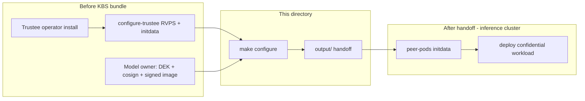

# KBS configuration for TEE remote attestation

This directory contains **KBS-only** steps for a **Trustee cluster** that releases secrets to **remotely attesting** confidential guests (for example AMD SNP peer pods on a **different** inference cluster).

It does **not** deploy workloads or peer pods. It assumes Trustee is already installed and that model artifacts are prepared elsewhere.

## What this configures

| KBS resource | Purpose |
|--------------|---------|
| `confidential-inferencing-signature` | Cosign public key for image pull verification |
| `trustee-image-policy` | Sigstore policy JSON (which images may be pulled) |
| `confidential-inferencing-dek` | Model DEK released only after attestation |
| `trusteeconfig-resource-policy` | Rego: allow `AzSnpVtpm`, deny `sample`-only attesters |

Guest path after configuration: **RCAR attestation** (`POST /kbs/v0/auth`, `POST /kbs/v0/attest`) → attestation token → **GET** `default/confidential-inferencing-dek/dek` (JWE to guest session key).

## Directory layout

```
kbs-tee-attestation/
  inputs/          dek.bin, cosign.pub (from model owner)
  output/          kbs.url, kbs-ca.pem, kbs-resource-path.txt, initdata.toml (generated)
  policy/          Rego + verification-policy template
  scripts/         register DEK, policy, resource rules, export endpoint
  operator.env.example
  Makefile
```

## Prerequisites (before KBS config)

Complete these **on the KBS cluster** (or document who owns each step) **before** `make configure`.

### 1. Trustee operator + base Trustee install

On an ARO (or Kubernetes) cluster with cluster-admin:

1. Install **Trustee operator** and a `TrusteeConfig` (coco-infra `configure-trustee.sh` or equivalent).
2. Confirm pods are ready:

   ```bash
   oc get pods -n trustee-operator-system -l app=kbs
   oc get trusteeconfig trusteeconfig -n trustee-operator-system
   ```

3. **RVPS reference values** and **guest initdata** must match the **pod VM image** your inference cluster will run (`coco-infra/aro/configure-trustee.sh` with `TRUSTEE_ENV=gen`). The operator copies `initdata.toml` into `output/` when you run `make export-endpoint`.

Without matching RVPS/initdata, attestation verifies the wrong measurements and DEK release fails even when policy is correct.

### 2. Remote attestation must be enabled on Trustee / KBS

KBS always uses the **RCAR** protocol for hardware attestation; there is no separate “enable attestation” switch on the HTTP API. For **cross-cluster** guests you need:

| Requirement | Why |
|-------------|-----|
| **`TrusteeConfig.spec.attestationTokenVerificationSpec`** | KBS validates attestation result tokens before the resource plugin releases secrets. `make ensure-remote-attestation` patches this if missing (`tlsSecretName: trustee-token-cert`). |
| **`[attestation_service]` in KBS config** | Trustee operator **AllInOne** deployments use `type = "coco_as_builtin"` (default). Attestation verification must not be stripped from `trusteeconfig-kbs-config`. |
| **HTTPS Route** (`kbs-service`) | Remote CVMs reach KBS at a public/cluster hostname. Created by coco-infra or `ensure-remote-attestation.sh`. |
| **Network path** | Inference cluster → KBS route (443). Firewall / DNS must allow guest egress to that host. |
| **Resource Rego policy** | `make apply-resource-policy` — only **AMD SNP** (`AzSnpVtpm`) gets the DEK; `sample` attester denied. |

Optional (not used by default operator profile): `[attestation_service] type = "coco_as_grpc"` if Attestation Service runs in a separate pod ([trustee KBS config](https://github.com/confidential-containers/trustee/blob/main/kbs/docs/config.md)).

`TrusteeConfig.spec.profileType: Restricted` (coco-infra default) is fine for remote guests; the important part is **token verification + SNP resource policy**, not switching to Permissive.

### 3. Model owner artifacts (inputs/)

Assume the model owner has already:

| Artifact | Assumption |
|----------|------------|
| **`inputs/dek.bin`** | DEK generated and used to encrypt `model.pt.enc` |
| **`inputs/cosign.pub`** | Key pair from `make setup-cosign` in the main repo |
| **Container image** | Built and pushed; signed with cosign (**v2 `.sig` tag** for CDH — see main README `make fix-image-sign`) |
| **`IMAGE` env** | Same image reference as in `operator.env` (repo + tag) |

Copy files into `inputs/` or set `DEK_FILE` / `COSIGN_PUB` in `operator.env`.

### 4. Inference cluster (not configured here)

The **inference** cluster operator must do this **after** you share `output/`:

- Apply **`initdata.toml`** to peer-pods (`INITDATA` in `peer-pods-cm`) — must match **this** KBS URL, CA, and RVPS.
- Set workload `KBS_URL`, mount `kbs-ca`, `KBS_RESOURCE_PATH` (see main repo `config/inference-remote.env.example`).
- Build workload image with **`kbs-client` + `az-snp-vtpm-attester`** (`make build-kbs-client` in parent repo).

## Quick start (KBS cluster)

```bash
cd kbs-tee-attestation
cp operator.env.example operator.env
# edit IMAGE; copy inputs/dek.bin and inputs/cosign.pub

set -a && source operator.env && set +a
oc login <kbs-cluster>

make configure
```

`configure` runs: ensure remote attestation → register policy → register DEK → SNP resource policy → export endpoint → verify.

Share **`output/`** with the inference cluster team:

- `kbs.url` — HTTPS KBS base URL  
- `kbs-ca.pem` — TLS trust anchor for guests  
- `kbs-resource-path.txt` — e.g. `default/confidential-inferencing-dek/dek`  
- `initdata.toml` — peer-pods initdata (if present)

## Order of operations (summary)



## Verify attestation works

On the **KBS** cluster after a confidential guest has started on the inference cluster:

```bash
make verify

oc logs -n trustee-operator-system deployment/trustee-deployment --tail=50 \
  | grep -E 'Verifier|/attest|confidential-inferencing-dek|PolicyDeny'
```

**Good signs:**

- `Verifier/endorsement check passed. tee=AzSnpVtpm`
- `POST /attest` **200**
- `GET .../confidential-inferencing-dek/dek` **200**

**Failure modes:**

| Log / symptom | Action |
|---------------|--------|
| No `/attest` lines | Guest cannot reach KBS URL; fix route/firewall/initdata |
| `tee=Sample` + `PolicyDeny` on DEK | Non-CVM or `kbs-client` without SNP attester |
| `PolicyDeny` on `trustee-image-policy` with `tee=AzSnpVtpm` | Re-run `make apply-resource-policy` |
| Image pull denied | Image not signed or wrong `IMAGE` in policy |

## Makefile targets

| Target | Description |
|--------|-------------|
| `configure` | Full operator flow |
| `ensure-remote-attestation` | TrusteeConfig token verification + route + sanity checks |
| `register-policy` | Cosign policy + pubkey secrets |
| `register-dek` | DEK secret + `kbsSecretResources` |
| `apply-resource-policy` | SNP-only Rego |
| `export-endpoint` | Write `output/` handoff |
| `verify` | Post-config checks |

## Relation to main repo

Parent repo scripts (`scripts/kbs/*`, `make operator-cluster`) perform the same steps with `artifacts/operator-bundle/`. This directory is a **focused, portable** layout for teams that only operate KBS.

See also: [docs/attestation-and-policy.md](../docs/attestation-and-policy.md).
